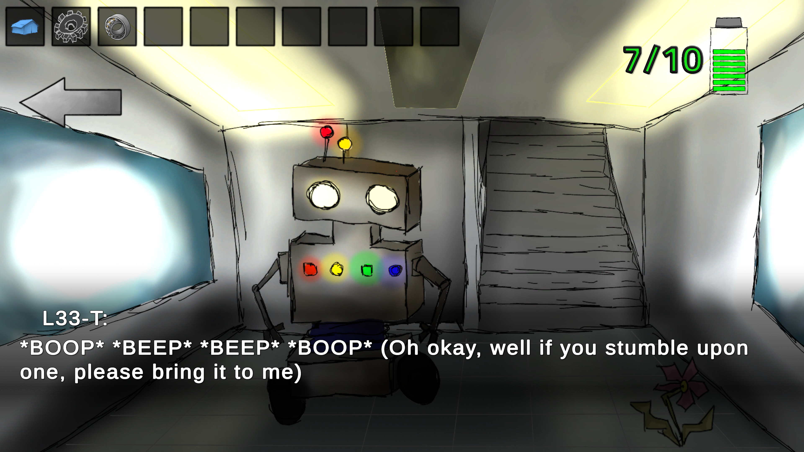
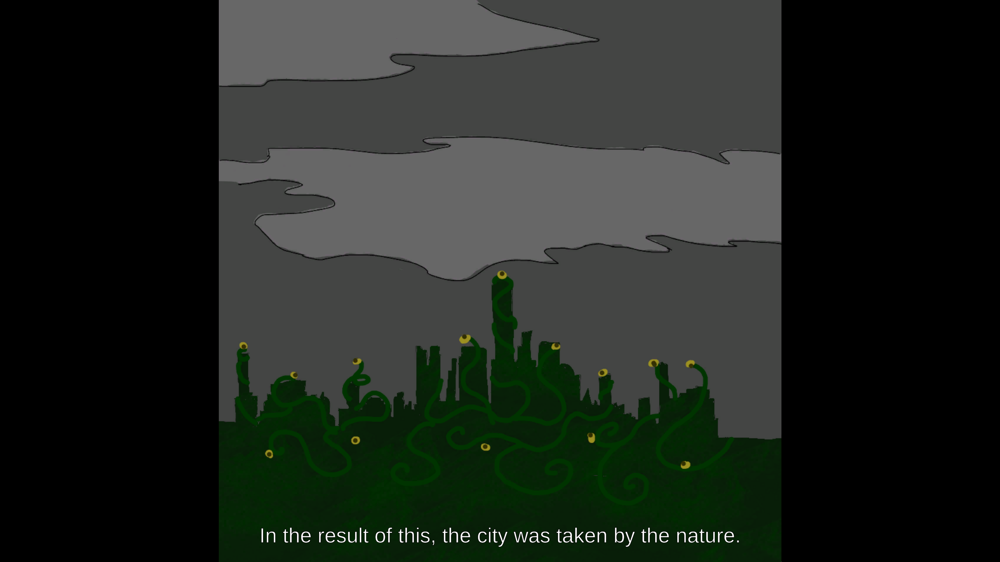
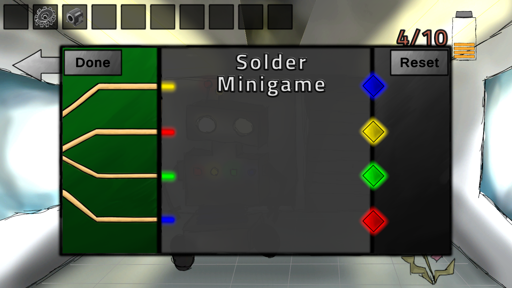
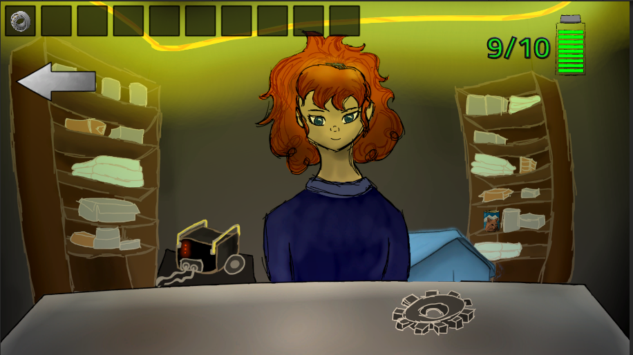

# Awoken - Source Code

## About
This repository contains the source code for Awoken, a point-and-click adventure game created as a submission for Špongia 2023 by Team "Chorá Puma", a group of six high school students from Gymnázium Alejová 1, Košice.

Visit our official website: [awoken.hamper.dev](https://awoken.hamper.dev)

## Gameplay
- Navigate a robot on a map by right-clicking on the path.
- Interact with objects using right or left mouse button while hovering over them.
- Some objects transport you to different rooms with new interactions.
- Engage in dialogues by left-clicking over the dialogue panel.
- Make decisions in dialogues by clicking on highlighted text options.
- Manage the robot's battery level throughout the game.
- Achieve one of 8 different endings, with "The Martyr" being the main goal.

## Screenshots
Here are some screenshots from the game:

## Controls
- Right-click: Move the robot
- Left/Right-click: Interact with objects
- Left-click: Progress through dialogues and make choices
- Escape (in main scene): Open quit/settings menu

## Features
- Battery management system
- Multiple endings (8 in total)
- Saved progress for achieved endings
- Volume control for music and sounds

## Installation
### Windows Build (Submitted Version)
1. Download `Build.zip`
2. Unzip the file
3. Run `Awoken.exe`

### Browser Version
Play the latest version directly in your browser at [awoken.hamper.dev](https://awoken.hamper.dev)

## Credits
Developed by Team "Chorá Puma":
- Teodor Barča - Python Programmer
- Michal Petričko - C enthusiast
- Michal Katriňák - Artist/Designer
- Abigail Beblavá - Artist
- Oliver Seman - Programmer
- Kristián Ohman - Music composer
